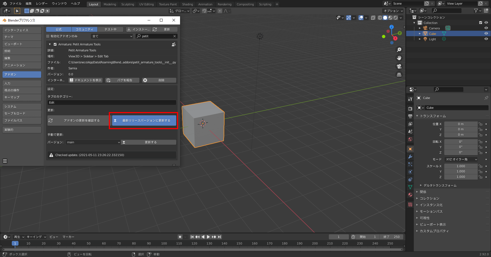

# Blender Add-on : Petit Armature Tools

## Petit Armature Toolsについて

『Petit Armature Tools』は、Blenderでアーマチュアとボーン作成を少し便利にするアドオンです。  

### アドオンの機能

#### ボーンを作成
- [選択した順序で辺の位置にボーンを作成](#選択した順序で辺の位置にボーンを作成)
- [選択した順序で辺ループの中点にボーンを作成](#選択した順序で辺ループの中点にボーンを作成)

## 動作対象のBlenderバージョン

- Blender 2.79b
- Blender 2.83.x LTS
- Blender 2.92.x

## ダウンロード

[最新バージョンをダウンロードする](https://github.com/samia-done/Petit-Armature-Tools/releases/latest/download/petit_armature_tools.zip)  

## インストール方法

1. Blenderの［編集］メニュー→［プリファレンス］の順にクリックして、［Blenderプリファレンス］画面を開きます。  

1. ナビゲーションバーにある［アドオン］をクリックして、アドオンセクションを表示します。  

1. ［インストール］ボタンをクリックして［Blenderファイルビュー］の画面を開きます。
1. ダウンロードした［Petit Armature Tools］のZipファイルを選択し、［アドオンをインストール］ボタンをクリックします。  

1. ［Petit Armature Tools］の左にある［アドオンを有効化］にチェックをつけて、アドオンを有効にします。  

## 使い方

アドオンをインストールすると、メッシュの［編集モード］の［編集］タブに、［Petit Armature Tools］パネルが追加されます。  

このアドオンは、辺の選択のみの状態でしか機能しません。  
［Petit Armature Tools］パネルのボタンが押せない状態ときは、［辺選択］のみを有効にしてください。

### 選択した順序で辺の位置にボーンを作成

選択した辺の順序で、辺と同じ位置にボーンを作成します。

1. メッシュの［編集モード］で、［辺選択］のみを有効にします。  

2. ボーンを作成したい位置にある辺を1つ以上選択します。
3. ［編集］タブにある［選択した順序で辺の位置にボーンを作成］ボタンをクリックします。  

4. 新しくアーマチュアオブジェクトとボーンが作成されました。  
［自動ウェイト］オプションが有効な場合、メッシュのオブジェクトにアーマチュアモディファイアが設定されます。

5. ボーンを動かしてみると、メッシュにウェイトが設定されていることを確認できます。

#### 注意-1

- <kbd>Ctrl + Click</kbd>や、<kbd>Alt + Click</kbd>で選択した辺などは1つとしてカウントされます。<kbd>Shift + Click</kbd>で複数の辺を選択するようにしてください。

- ［自動ウェイト］が有効のときに、オブジェクトにボーン名と同じ名前の頂点グループが既に作成されている場合は、エラーが表示され終了します。(同じ名前の頂点グループは作成できないため)  
その場合、以下のいずれかの方法で対処するようにしてください。
  - ［自動ウェイト］をオフにする
  - 設定オプションで別のボーン名に変更する
  - 頂点グループが不要ならば、オブジェクトから頂点グループを削除する

#### 設定オプション-1

ベース名
: ボーンのベース名

区切り文字
: ボーン名の区切り文字

接頭辞
: ボーン名の先頭につける文字

接尾辞
: ボーン名の末尾につける文字。

連番の開始番号
: 自動で割り振られる連番の開始番号。

連番の桁数
: 自動で割り振られる連番の桁数。

自動ボーンロール
: 自動でボーンロールを設定する機能を有効にします

自動ウェイト
: 自動でウェイトを設定する機能を有効にします

自動インクリメント
: 開始番号の自動インクリメントを有効にします

ペアレント(親)
: 一つ前に作成したボーンを、親ボーンに設定します。

接続
: ボーンに親があるとき、ボーンのヘッドを親ボーンのテールの位置に接続します。

オフセット
: ボーンを作成するとき、位置のオフセットを有効にします。  
［オフセット値］ボックスに辺の位置から離す距離を入力します。

### 選択した順序で辺ループの中点にボーンを作成

2つ以上選択した辺ループの順序で、辺ループの中点にボーンを作成します

1. メッシュの［編集モード］で、［辺選択］のみを有効にします。  

2. ボーンを作成したい位置にあるループ辺を2つ以上選択します。  

3. チューブのような形状のループ辺を連続で選択したいときは、［選択］メニューにある［選択の拡大］から［次のアクティブ］を実行します。  

4. 次のループ辺を選択できました。  
 
5. キーボードの<kbd>Shift + R</kbd>を押すと、先ほどと同じ操作（ここでは、［次のアクティブ］）を繰り返すことができます。  

6. ボーンを作成したい位置までループ辺を選択したら、［編集］タブにある［選択した順序で辺の位置にボーンを作成］ボタンをクリックします。  

7. 新しくアーマチュアオブジェクトとボーンが作成されました。  
［自動ウェイト］オプションが有効な場合、メッシュのオブジェクトにアーマチュアモディファイアが設定されます。

8. ボーンを動かしてみると、メッシュにウェイトが設定されていることを確認できます。  

#### 注意-2

- <kbd>Ctrl + Click</kbd>や、<kbd>Alt + Click</kbd>で選択した辺などは1つとしてカウントされます。<kbd>Shift + Click</kbd>で複数の辺を選択するようにしてください。
- ［自動ウェイト］が有効のときに、オブジェクトにボーン名と同じ名前の頂点グループが既に作成されている場合は、エラーが表示され終了します。(同じ名前の頂点グループは作成できないため)  
その場合、以下のいずれかの方法で対処するようにしてください。
  - ［自動ウェイト］をオフにする
  - 設定オプションで別のボーン名に変更する
  - 頂点グループが不要ならば、オブジェクトから頂点グループを削除する

#### 設定オプション-2

ベース名
: ボーンのベース名

区切り文字
: ボーン名の区切り文字

接頭辞
: ボーン名の先頭につける文字

接尾辞
: ボーン名の末尾につける文字

連番の開始番号
: 自動で割り振られる連番の開始番号

連番の桁数
: 自動で割り振られる連番の桁数

自動ウェイト
: 自動でウェイトを設定する機能を有効にします

ペアレント(親)
: 一つ前に作成したボーンを、親ボーンに設定します

接続
: ボーンに親があるとき、ボーンのヘッドを親ボーンのテールの位置に接続します

## エラーメッセージ

### 頂点グループはすでに作成されています

- ［自動ウェイト］が有効のときに、オブジェクトにボーン名と同じ名前の頂点グループが既に作成されている場合に表示されるエラーです。
- メッシュに設定されている頂点グループとウェイトを維持したままボーンの作成のみをやり直したい場合には、［自動ウェイト］のチェックを外すことでこのエラーを回避できます。

### このメッシュには辺がありません
- メッシュに辺が無い状態で［選択した順序で辺の位置にボーンを作成］を実行した際に表示されるエラーです。

### 1つ以上辺を選択してください

- 選択された辺が無い状態で［選択した順序で辺の位置にボーンを作成］を実行した際に表示されるエラーです。

### このメッシュには複数の辺がありません

- メッシュに辺が2つ以上無い状態で、［選択した順序で辺ループの中点にボーンを作成］を実行した際に表示されるエラーです。

### 2つ以上ループ辺を選択してください

- 選択されたループ辺が2つ以上無い状態で、［選択した順序で辺ループの中点にボーンを作成］を実行した際に表示されるエラーです。

### 空白の名前は使用できません

- 作成するボーンの名前が、何らかの原因で空白になってしまった場合に出るエラーです。
- パネルのオプション項目にあるボーン名が、適切に設定されているかどうか確認してください。

## アップデート方法

本アドオンは、［Blenderプリファレンス］画面からアドオンの最新バージョンに更新することができます。
アドオンを更新する際には、Blenderを終了して開き直してから行うようにしてください。

1. Blenderの［編集］メニュー→［プリファレンス］の順にクリックして、［Blenderプリファレンス］画面を開きます。
2. ナビゲーションバーにある［アドオン］をクリックして、アドオンセクションを表示します。  

3. ［Petit Armature Tools］の左にある［下向き三角］をクリックして、アドオンの設定パネルを開きます。
4. ［アドオンの更新を確認する］ボタンをクリックします。  

5. アドオンに更新があった場合には、［最新リリースバージョンに更新する］ボタンが表示されます。  
［最新リリースバージョンに更新する］ボタンをクリックします。  

6. アドオンが更新されました。Blenderを再起動してください。  

## ライセンス

[GPL License](LICENSE)

## 免責事項

- Samiaは、利用者が本アドオンを使用することによって生じるいかなる損害に対して一切責任を負いません。

## 著者

GitHub:[Samia](https://github.com/samia_done)  
Twitter:[@samia_done](https://twitter.com/samia_done)
